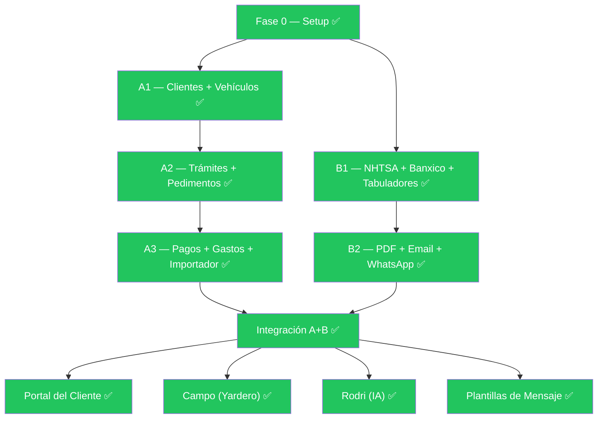

# Auditoría Completa — R&R Importaciones

> **Fecha:** 15 de mayo de 2026  
> **Versión actual:** MVP funcional (Fase 0 + Camino A + Camino B + Integración A+B + Portal + Campo + Rodri)

---

## Mapa de Avance por Fase



> [!NOTE]
> **Todo el roadmap original del Kit de Arranque está implementado**, más funcionalidades extra no previstas en el MVP original (Portal, Campo, Rodri, Plantillas, Bancos, Recibos PDF).

---

## 1. Inventario de Módulos Implementados

### Backend (28 servicios, 24 controllers, 37 entidades)

| Módulo | Controller | Service | Entidades | Estado |
|--------|-----------|---------|-----------|--------|
| **Auth** | `AuthController` | `AuthService`, `JwtService` | `User`, `RefreshToken`, `Role`, `Permission` | ✅ Completo |
| **Clientes** | `ClientesController` | `ClienteService` | `Cliente` | ✅ Completo |
| **Vehículos** | `VehiculosController` | `VehiculoService` | `Vehiculo`, `Marca`, `Modelo` | ✅ Completo |
| **Trámites** | `TramitesController` | `TramiteService`, `TramiteStateService` | `Tramite`, `Evento`, `Pedimento`, `Entrega` | ✅ Completo |
| **Pagos** | `PagosController` | `PagoService`, `PagoReciboPdfService` | `Pago` | ✅ Completo |
| **Gastos Hormiga** | `GastosHormigaController` | `GastoHormigaService` | `GastoHormiga`, `TipoGastoHormiga` | ✅ Completo |
| **Cotizador** | `CotizacionesController` | `CotizadorService`, `CotizacionPdfService` | `Cotizacion`, `CotizacionDetalle` | ✅ Completo |
| **NHTSA** | via `CotizacionesController` | `NhtsaService` | `NhtsaCache` | ✅ Completo |
| **Banxico** | via `CotizacionesController` | `BanxicoService` | `TipoCambioCache` | ✅ Completo |
| **Email** | via `CotizacionesController` | `EmailService` | — | ✅ Completo |
| **WhatsApp** | via `CotizacionesController` | `WhatsAppCotizacionService` | — | ✅ Completo |
| **Plantillas** | `AdminPlantillasController` | `PlantillaMensajeService` | `PlantillaMensaje` | ✅ Completo |
| **Portal** | `PortalController` | (inline en controller) | — | ✅ Completo |
| **Campo** | `CampoController` | `CampoService` | `TareaCampo` | ✅ Completo |
| **Rodri (IA)** | `RodriController` | `RodriService` | — | ✅ Completo |
| **Importador** | `AdminImportadorController` | `DataImportService` | — | ✅ Completo |
| **Auditoría** | `AuditoriaController` | (inline) | `AuditoriaLog` | ✅ Completo |
| **Catálogos** | 6 controllers | 6 services | `Aduana`, `Tramitador`, `PersonalCampo`, `PartnerExterno`, `Banco`, etc. | ✅ Completo |
| **Reportes** | `ReportesController` | (usa `CotizadorService`) | — | ⚠️ Solo conversión cotizaciones |
| **Parámetros Fiscales** | `AdminParametrosFiscalesController` | `ParametroFiscalService` | `ParametroFiscal` | ✅ Completo |
| **Usuarios/Roles** | `UsuariosController`, `RolesController` | `UsuarioService` | `User`, `Role`, `Permission` | ✅ Completo |

### Frontend (17 páginas, 26 servicios, 2 guards, 1 interceptor)

| Página | Ruta | Componente(s) | Estado |
|--------|------|--------------|--------|
| Login | `/login` | `LoginComponent` | ✅ |
| Dashboard | `/inicio` | `DashboardComponent` | ✅ Datos reales |
| Clientes | `/clientes`, `/clientes/:id` | Lista + Detalle | ✅ |
| Vehículos | `/vehiculos`, `/vehiculos/:id` | Lista + Detalle | ✅ |
| Trámites | `/tramites`, `/tramites/:id` | Lista + Detalle + Form | ✅ |
| Inventario | `/inventario` | `InventarioComponent` | ✅ |
| Cotizaciones | `/cotizaciones/*` | Nueva + Lista + Detalle | ✅ |
| Pagos | `/pagos` | `PagosListComponent` | ✅ |
| Gastos Hormiga | `/gastos-hormiga` | `GastosHormigaListComponent` | ✅ |
| Campo | `/campo`, `/campo/:id/captura` | Tareas + Captura | ✅ |
| Portal Cliente | `/portal/tramite/:id` | `PortalTramiteComponent` | ✅ Público |
| Reportes | `/reportes/cotizaciones` | `ReporteCotizacionesComponent` | ✅ |
| Admin | `/admin/*` | Importador + Parámetros + Plantillas | ✅ |
| Catálogos | `/marcas`, `/aduanas`, etc. | 6 componentes | ✅ |
| Usuarios | `/usuarios` | `UsuariosComponent` | ✅ |
| Roles | `/roles` | `RolesComponent` | ✅ |
| Auditoría | `/auditoria` | `AuditoriaComponent` | ✅ |

---

## 2. Puntos Pendientes de Conectar

> [!WARNING]
> Estos son puntos donde la infraestructura existe pero la conexión entre componentes no está completa.

### 2.1 🔴 Almacenamiento de archivos — Cloudflare R2 sin conexión real

**Estado:** La configuración de R2 está en `appsettings.json` (Account ID, Access Key, Secret) y hasta hay un archivo `cloudflare R2.txt` con credenciales, pero `FileStorageService` probablemente opera en modo **Local** (`Storage.Provider: "Local"`). Los comprobantes de pago, fotos de campo y PDFs de cotizaciones se guardan en `/backend/storage/`.

**Impacto:** En producción con múltiples instancias o deploys, los archivos locales se pierden. El portal del cliente expone URLs de storage local que no serán alcanzables externamente.

### 2.2 🔴 SMTP — No configurado para producción

**Estado:** `appsettings.json` apunta a `sandbox.smtp.mailtrap.io` con credenciales vacías (`Username: ""`, `Password: ""`). El servicio de email va a fallar silenciosamente en producción.

**Impacto:** El envío de cotizaciones por email no funciona fuera de desarrollo.

### 2.3 🟡 Reportes — Extremadamente limitados

**Estado:** `ReportesController` tiene **un solo endpoint**: conversión de cotizaciones. No hay reportes operativos ni financieros.

**Lo planeado que falta:**
- Reporte de trámites por período/estado/tramitador
- Reporte financiero: cobrado vs por cobrar vs gastos
- Reporte de gastos hormiga por categoría/cliente
- Estado de cuenta por cliente
- Reporte de productividad por tramitador

### 2.4 🟡 Máquina de estados — Incoherencia entre estados del plan vs implementación

**Estado:** El Kit de Arranque define 6 estados (`PENDIENTE_TRAMITE → EN_PROCESO → ROJO_DESADUANADO → VERDE_ENTREGADO → AMARILLO_PENDIENTE_PAGO → COBRADO`), pero el Portal del cliente define **16 estados** (incluyendo `FOTOS_SOLICITADAS`, `BAJA_EN_PROCESO`, `PEDIMENTO_DOCUMENTADO`, `MANDADO_A_CRUCE`, etc.), mientras el `TramiteStateService` y `RodriService` usan subconjuntos diferentes.

**Impacto:** Los estados del portal no tienen transiciones validadas en `TramiteStateService`. Los estados extra del portal (`FOTOS_SOLICITADAS`, `BAJA_EN_PROCESO`, etc.) solo existen como mappeo en el controller del portal pero no como estados reales que la máquina de estados del backend reconoce.

### 2.5 🟡 Asignación automática de AMARILLO_PENDIENTE_PAGO

**Estado:** La regla de negocio dice "AMARILLO se asigna automáticamente cuando el trámite está en VERDE_ENTREGADO + saldo > 0 + 7 días desde entrega". No hay background job implementado para esto; solo existe `CotizacionesExpirationJob`.

### 2.6 🟡 Búsqueda global Cmd+K

**Estado:** El topbar del plan contempla una búsqueda global, pero no hay evidencia de implementación en el frontend.

### 2.7 🟡 Notificaciones in-app

**Estado:** Hay un `RealtimeHub` (SignalR) y un `IRealtimeNotifier`, un `notification.service.ts` y un `realtime.service.ts` en el frontend. La infraestructura existe pero las notificaciones como feature (campana en topbar, notificaciones push, etc.) parecen incompletas o solo parciales.

### 2.8 🟡 FluentValidation — Solo en Login

**Estado:** Solo existe `LoginRequestValidator.cs`. Todos los demás endpoints validan con `if/throw` inline en los servicios. No hay validación por pipeline middleware.

---

## 3. Deuda Técnica Detectada

### 3.1 🔴 Secretos expuestos en `appsettings.json`

> [!CAUTION]
> **Credenciales de producción hardcodeadas en el repositorio:**
> - Connection string de Neon PostgreSQL con password: `npg_srZGOUW2wV1v`
> - Banxico API Token: `9a62dfc...`
> - Gemini API Key: `AIzaSyBQ...`
> - JWT Secret Key: `AQUI_TU_SECRET_KEY_MINIMO_32_CARACTERES!` (placeholder débil)
> - Cloudflare R2 keys en `cloudflare R2.txt` en la raíz del repo
>
> **Riesgo:** Cualquier persona con acceso al repo tiene acceso total a la base de datos, APIs externas y storage.

### 3.2 🔴 Sin tests automatizados

No hay ningún proyecto de tests en el backend. El plan decía "5 endpoints principales funcionando con tests de integración" pero no se implementó. Karma/Jasmine están configurados en frontend pero sin tests funcionales.

### 3.3 🟡 CotizadorService — God Object (1,052 líneas)

El servicio más grande del sistema. Mezcla:
- Resolución de vehículos (NHTSA)
- Lookup de precios
- Cálculo fiscal
- CRUD de cotizaciones
- Dashboard de cotizaciones
- Conversión a trámite
- Generación de folio
- Reporte de conversión

### 3.4 🟡 RodriService — System prompt con todo el negocio en memoria

Carga **toda** la base de datos en un solo prompt (~10 queries con Include completos): trámites, clientes, pagos, gastos, cotizaciones, pedimentos, tramitadores, usuarios, personal de campo. Con un negocio de 500+ trámites, este prompt puede exceder los límites del modelo de IA.

### 3.5 🟡 Duplicación de lógica de conversión monetaria

`ConvertPagoToMxn` existe como método estático en **4 archivos diferentes**: `PagoService`, `TramiteService`, `PortalController`, `GastoHormigaService`. Misma lógica copiada.

### 3.6 🟡 Enums como strings mágicos

Todos los estados, tipos, métodos de pago están como strings raw: `"PENDIENTE_TRAMITE"`, `"TRANSFERENCIA"`, `"USD"`, etc. Sin enums tipados, propenso a typos.

### 3.7 🟡 JWT con expiración de 24 horas

`ExpirationMinutes: 1440` (24h) es excesivo para un sistema financiero. El plan decía 15 minutos.

---

## 4. Lo que falta para dejar de ser MVP

### 🏗️ Infraestructura de Producción

| Necesidad | Prioridad | Esfuerzo |
|-----------|-----------|----------|
| **Mover secretos a variables de entorno** / Azure Key Vault / .env | 🔴 Crítico | 2h |
| **Configurar CORS para dominio real** (actualmente solo localhost) | 🔴 Crítico | 30m |
| **Conectar Cloudflare R2** para storage de archivos | 🔴 Alto | 4h |
| **Configurar SMTP real** (dominio rrimportaciones.com) | 🔴 Alto | 1h |
| **Despliegue CI/CD** (GitHub Actions → Railway/Fly.io/Azure) | 🟡 Alto | 8h |
| **Dominio y SSL** para el portal público | 🟡 Alto | 2h |
| **Health checks** y monitoring básico | 🟡 Medio | 3h |
| **Rate limiting** en endpoints públicos (Portal, Login) | 🟡 Medio | 2h |
| **Backups automáticos** de PostgreSQL | 🟡 Medio | 2h |

---

### 📊 Reportes y Analítica (lo más crítico para dejar de ser MVP)

| Reporte | Descripción | Prioridad |
|---------|-------------|-----------|
| **Estado de cuenta por cliente** | Todos los trámites + pagos + saldo global de un cliente. Exportable a PDF/Excel. | 🔴 Crítico |
| **Reporte financiero mensual** | Cobrado, por cobrar, gastos hormiga, margen neto por período | 🔴 Alto |
| **Pipeline de trámites** | Cuántos en cada estado, tiempo promedio por estado, cuellos de botella | 🟡 Alto |
| **Productividad por tramitador** | Trámites cerrados, días promedio, cobro total por tramitador | 🟡 Medio |
| **Reporte de gastos hormiga** | Por categoría, por cliente, tendencia temporal | 🟡 Medio |
| **Dashboard ejecutivo mejorado** | Gráficas temporales (ECharts ya está en las dependencias pero no se usa para esto) | 🟡 Medio |

---

### 🔒 Seguridad y Robustez

| Necesidad | Prioridad |
|-----------|-----------|
| **Reducir JWT a 15-30 min** + refresh token automático | 🔴 Alto |
| **HTTPS enforcement** | 🔴 Alto |
| **Validación con FluentValidation** en todos los endpoints (no solo login) | 🟡 Medio |
| **Audit trail completo** — actualmente solo pagos tienen auditoría seria | 🟡 Medio |
| **Política de contraseñas** — actualmente no hay validación de fortaleza | 🟡 Medio |
| **Bloqueo de cuenta** tras N intentos fallidos | 🟡 Medio |
| **2FA** para admin | 🟢 Bajo (futuro) |

---

### 🎨 UX/UI para Producto

| Mejora | Descripción | Prioridad |
|--------|-------------|-----------|
| **Búsqueda global (Cmd+K)** | Buscar trámites, clientes, VIN desde cualquier pantalla | 🟡 Alto |
| **Notificaciones in-app** | Campana con notificaciones cuando un pago se verifica, cuando un trámite cambia de estado, etc. | 🟡 Alto |
| **Onboarding / Wizard de primer uso** | Guía para configurar SMTP, primer cliente, primer trámite | 🟡 Medio |
| **Dark mode** | El design system ya contempla la paleta; falta el toggle | 🟢 Bajo |
| **PWA / App móvil** | Para personal de campo y acceso rápido del admin | 🟢 Futuro |
| **Accesibilidad (a11y)** | Contraste, keyboard navigation, screen readers | 🟡 Medio |

---

### 🔗 Integraciones Pendientes para Producción

| Integración | Estado actual | Lo que falta |
|-------------|--------------|-------------|
| **WhatsApp Business API** | Deep link (wa.me) manual | API oficial de Meta para envío directo sin intervención manual |
| **Portal del Cliente — notificaciones push** | Solo visualización pasiva | El cliente debería recibir email/SMS cuando su trámite cambia de estado |
| **Facturación electrónica (CFDI)** | No existe | Integración con PAC para generar facturas |
| **SAT — consulta de pedimentos** | No existe | Validar pedimentos contra el SAT |
| **Cobro en línea** | No existe | Stripe/Conekta para que clientes paguen desde el portal |

---

### 🧪 Testing y Calidad

| Necesidad | Prioridad |
|-----------|-----------|
| **Tests unitarios del cotizador** — los cálculos fiscales son el corazón del negocio | 🔴 Crítico |
| **Tests de integración de la máquina de estados** | 🔴 Alto |
| **Tests del importador de datos** | 🟡 Medio |
| **Tests E2E del flujo cotización → trámite → pago → cobrado** | 🟡 Alto |
| **CI pipeline** que ejecute tests en cada PR | 🟡 Alto |

---

## 5. Propuestas de Mejora Arquitectónica

### 5.1 Extraer dominio de cálculo fiscal como librería pura

`CotizadorService` mezcla persistencia con lógica de negocio. El **motor de cálculo fiscal** (determinar régimen, fracción, impuestos) debería ser una clase pura sin dependencias de EF Core, testeable unitariamente.

```
RR.Domain/
  Calculators/
    FiscalCalculator.cs       ← lógica pura, 100% testeable
    FraccionClassifier.cs     ← determina fracción por cilindrada/tipo
    RegimenResolver.cs        ← determina régimen por año
```

### 5.2 Consolidar la máquina de estados

La máquina de estados actual tiene 6 estados "core" + 10 estados "portal" que coexisten sin integración. Propuesta:

```
Flujo real del negocio (16 estados):
PENDIENTE → FOTOS_SOLICITADAS → FOTOS_RECIBIDAS → REQUISITOS_PENDIENTES →
BAJA_EN_PROCESO → BAJA_COMPLETADA → LISTO_PARA_PEDIMENTO → PEDIMENTO_DOCUMENTADO →
PAGO_PEDIMENTO_PENDIENTE → MANDADO_A_CRUCE → LIBERADO → EN_ENTREGA →
ENTREGADO → AMARILLO_PENDIENTE_PAGO → COBRADO
(+ CANCELADO como terminal)
```

- Actualizar `TramiteStateService` con las 16 transiciones reales
- Actualizar `RodriService` para reconocerlos
- El portal ya los mapea correctamente

### 5.3 Event-driven para notificaciones

Cuando un trámite cambia de estado:
1. Emitir un evento de dominio
2. Handlers: actualizar portal en tiempo real (SignalR), enviar email/SMS al cliente, registrar en auditoría

### 5.4 Paginación del system prompt de Rodri

En lugar de cargar toda la BD en el prompt, implementar un patrón RAG simplificado:
- Rodri recibe un resumen compacto + últimas alertas
- Si necesita detalle, hace llamadas a funciones (tool use) que consultan endpoints específicos

---

## 6. Resumen Ejecutivo

```
┌─────────────────────────────────────────────────────────────┐
│                    ESTADO DEL PROYECTO                       │
├─────────────────────────────────────────────────────────────┤
│  Fases completadas:          7/7 (100% del roadmap MVP)     │
│  Funcionalidades extra:      4 (Portal, Campo, Rodri, Rec.) │
│  Controllers:                24                              │
│  Servicios backend:          28                              │
│  Entidades de dominio:       37                              │
│  Páginas frontend:           17                              │
│  Migraciones DB:             13                              │
│  Tests automatizados:        0  ⚠️                           │
│  Validators FluentValidation: 1/24 endpoints                │
├─────────────────────────────────────────────────────────────┤
│  VEREDICTO: MVP funcional y sorprendentemente completo.      │
│  Para producción real necesita: seguridad, tests, reportes.  │
└─────────────────────────────────────────────────────────────┘
```

### Las 5 acciones más importantes para salir de MVP:

1. **🔴 Mover secretos fuera del código** — riesgo de seguridad inmediato
2. **🔴 Tests del cálculo fiscal** — el error más caro del negocio es cotizar mal
3. **🔴 Conectar R2 + SMTP real** — sin esto el sistema no puede comunicarse con clientes
4. **🟡 Reportes financieros** — el admin necesita visibilidad del negocio, no solo operación
5. **🟡 Consolidar máquina de estados** — el flujo real del negocio es más granular que los 6 estados MVP
